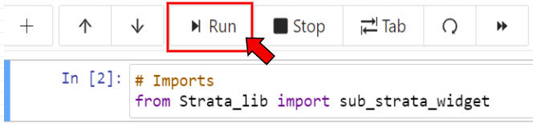

# Interactive Applets
---------------------

In this CoCalc there are a collection of jupyter widgets for producing simple examples related to multisegments, rank triangles, and Vogan Varieties.

All applets for use are given file names starting with "Interactive" and ending with the file extension ".ipynb". Clicking on any applet will generate a jupyter notebook with the associated applet inside. A markdown cell explaining the proper execution of the applet is also provided. 

## Usage

In order to run an applet and get to the interactive input portion, simply run the first cell containing import lines, as well as the cell immediately after the instructions. A cell can be run either by pressing the "run" button above the code cells, 

or by pressing shift+enter when the code cell you want to run is selected.

## NOTE

Please try to avoid editing any files found in this project. If you find issues that need to be fixed, or if there are any tools you would be interested seeing implemented let me know either over discord or through my email at elijah.thompson@ucalgary.ca.