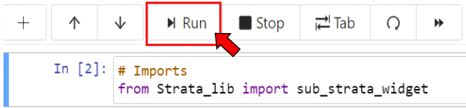

# Interactive Applets
---------------------

In this CoCalc there are a collection of jupyter widgets for producing simple examples related to multisegments, rank triangles, and Vogan Varieties.

All applets for use are given file names starting with "Interactive" and ending with the file extension ".ipynb". Clicking on any applet will generate a jupyter notebook with the associated applet inside. A markdown cell explaining the proper execution of the applet is also provided. 

## Usage

In order to run an applet and get to the interactive input portion, simply run the first cell containing import lines, as well as the cell immediately after the instructions. A cell can be run either by pressing the "run" button above the code cells, 



or by pressing shift+enter when the code cell you want to run is selected.

## NOTE

Please try to avoid editing any files found in this project. If you find issues that need to be fixed, or if there are any tools you would be interested seeing implemented let me know either over discord or through my email at elijah.thompson@ucalgary.ca.


# Personal Installation
---------------------

To install and use the applets found in this CoCalc project on your personal Windows device follow the following steps:

1. Install a python version. Recommended: https://www.anaconda.com/products/distribution
2. Next install sagemath, which for windows requires a linux subsystem.
    1. Follow the guide https://docs.microsoft.com/en-us/windows/wsl/install to install your linux subsystem and make sure to set WSL2 as default (as described in the guide). Then you can install an ubuntu version from the microsoft store
    2. As mentioned in the guide installing Windows Terminal is highly recommended for ease of use, and adding the Ubuntu terminal to the command line
    3. In your ubuntu terminal update and upgrade your distro by running ```sudo apt update```, ```sudo apt upgrade```, ```sudo apt dist-upgrade```, and ```sudo apt autoremove``` to remove redundant files. 
    4. Next install sage with ```sudo apt install sagemath```
3. To install Macaulay2 in your WSL subsystem simply run ```sudo add-apt-repository ppa:macaulay2/macaulay2``` and ```sudo apt install macaulay2``` in your Ubuntu terminal.
4. To install jupyter notebook in your WSL subsystem run ```sudo apt update``` ```sudo apt install python3-pip``` to obtain the python installer pip, then run ```pip3 install notebook```
5. Install widget libraries using ```pip3 install ipywidgets==7.7.0``` and ```pip3 install widgetsnbextension==3.6.0```
6. To open jupyter notebook in your browser run ```jupyter notebook``` in the file location you want to store your code


## Note 

If you don't want to install all of these programs on your personal computer but still want to edit files you can download the files from this CoCalc and then create your own CoCalc project to edit them in.
